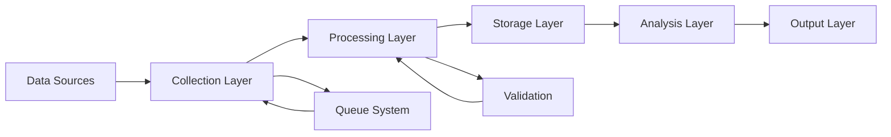

# Implementation Strategies & Tooling
## Indigenomics Hashtag Data Collection Project Phase 3

---

## Executive Summary

This document outlines comprehensive strategies and tooling recommendations to fulfill the requirements of the Indigenomics Hashtag Data Collection Project Phase 3 (August-October 2025). The project aims to create a robust dataset validating the $244B Indigenous economic figure while establishing Indigenous sovereign data governance frameworks.

---

## 1. Core Project Requirements Analysis

### 1.1 Key Deliverables
- **Historical Data Collection**: X/Twitter (2015-2025) and LinkedIn (2020-2025)
- **Canadian Data Assessment**: Review and utilize Northeastern University Jupyter notebooks
- **Data Expansion**: Integrate additional Indigenous economic sources
- **Automation Framework**: Scheduled updates and RAG integration
- **Documentation**: Lessons learned and recommendations

### 1.2 Target Hashtags
Primary:
- #indigenomics
- #indigenouseconomy
- #100billion
- #indigenousbusiness
- #indigenousprosperity

Secondary:
- #economicreconciliation
- #indigenousentrepreneur
- #indigenousentrepreneurship

### 1.3 Timeline
- **Start**: August 24, 2025
- **Milestone 1**: September 30, 2025
- **Completion**: October 31, 2025
- **Review**: Early November 2025

---

## 2. Data Collection Strategies

### 2.1 Twitter/X Data Scraping Strategy

#### Historical Data (2015-2025)
**Approach 1: Twitter API v2 (Recommended for compliance)**
```python
# Using Tweepy for Twitter API v2
import tweepy
from datetime import datetime, timedelta

class TwitterHistoricalScraper:
    def __init__(self, bearer_token):
        self.client = tweepy.Client(bearer_token=bearer_token)
    
    def search_historical(self, hashtag, start_date, end_date):
        query = f"#{hashtag} -is:retweet lang:en"
        tweets = tweepy.Paginator(
            self.client.search_all_tweets,
            query=query,
            start_time=start_date,
            end_time=end_date,
            max_results=500,
            tweet_fields=['created_at', 'author_id', 'public_metrics', 'entities']
        ).flatten(limit=10000)
        return tweets
```

**Approach 2: Advanced Search & Selenium (Fallback)**
```python
from selenium import webdriver
from selenium.webdriver.common.by import By
import time

def scrape_twitter_advanced_search(hashtag, start_date, end_date):
    driver = webdriver.Chrome()
    search_url = f"https://twitter.com/search?q=%23{hashtag}%20since%3A{start_date}%20until%3A{end_date}&src=typed_query&f=live"
    driver.get(search_url)
    # Implement scrolling and data extraction
```

#### Metadata Enrichment
- Author profiles and follower counts
- Engagement metrics (likes, retweets, replies)
- Media attachments (images, videos)
- Thread context and conversations
- Geolocation when available

### 2.2 LinkedIn Data Collection Strategy

#### API Approach (LinkedIn Marketing Developer Platform)
```python
import requests

class LinkedInScraper:
    def __init__(self, access_token):
        self.headers = {
            'Authorization': f'Bearer {access_token}',
            'X-Restli-Protocol-Version': '2.0.0'
        }
    
    def search_posts(self, hashtag):
        # Use ugcPosts API endpoint
        url = "https://api.linkedin.com/v2/ugcPosts"
        params = {
            'q': 'hashtag',
            'hashtag': hashtag,
            'count': 100
        }
        response = requests.get(url, headers=self.headers, params=params)
        return response.json()
```

#### Web Scraping Approach (with ethical considerations)
```python
from linkedin_api import Linkedin
import pandas as pd

# Using unofficial linkedin-api library
api = Linkedin(username, password)

def search_linkedin_posts(hashtag):
    posts = api.search_posts(
        keywords=f"#{hashtag}",
        limit=1000,
        offset=0
    )
    return pd.DataFrame(posts)
```

### 2.3 Additional Data Sources

#### News Outlets & Media
- **CBC Indigenous**: RSS feeds and API
- **APTN News**: Web scraping with consent
- **First Nations Drum**: Direct partnerships
- **Business Wire Indigenous sections**: API access

#### Government & Institutional Sources
- **Statistics Canada**: Indigenous economy reports
- **Indigenous Services Canada**: Economic development data
- **Provincial Indigenous economic councils**: Open data portals
- **CCAB (Canadian Council for Aboriginal Business)**: Research reports

#### Academic & Research
- **University repositories**: Indigenous economic research papers
- **Think tanks**: Conference Board of Canada, CD Howe Institute
- **Indigenous research centers**: Direct data partnerships

---

## 3. Technical Architecture & Tooling

### 3.1 Data Pipeline Architecture



### 3.2 Technology Stack Recommendations

#### Core Technologies
| Component | Primary Tool | Alternative | Rationale |
|-----------|-------------|------------|-----------|
| **Orchestration** | Apache Airflow | Prefect | Scheduling, monitoring, retry logic |
| **Data Collection** | Python (Scrapy/BeautifulSoup) | Node.js (Puppeteer) | Flexibility, ecosystem |
| **Queue System** | RabbitMQ | Redis Queue | Distributed processing |
| **Storage** | PostgreSQL + S3 | MongoDB + MinIO | Structured + blob storage |
| **Processing** | Apache Spark | Pandas/Dask | Scale considerations |
| **API Framework** | FastAPI | Django REST | Modern, async support |
| **Monitoring** | Grafana + Prometheus | ELK Stack | Real-time dashboards |

#### Python Libraries
```python
# requirements.txt
tweepy>=4.14.0          # Twitter API v2
selenium>=4.15.0        # Web automation
beautifulsoup4>=4.12.0  # HTML parsing
scrapy>=2.11.0         # Advanced scraping
pandas>=2.1.0          # Data manipulation
sqlalchemy>=2.0.0      # Database ORM
celery>=5.3.0          # Task queue
schedule>=1.2.0        # Job scheduling
spacy>=3.7.0           # NLP processing
transformers>=4.35.0    # Sentiment analysis
jsonschema>=4.20.0     # Data validation
```

### 3.3 Data Storage Schema

#### PostgreSQL Schema Design
```sql
-- Main posts table
CREATE TABLE social_posts (
    id UUID PRIMARY KEY DEFAULT gen_random_uuid(),
    platform VARCHAR(50) NOT NULL,
    post_id VARCHAR(255) UNIQUE NOT NULL,
    author_id VARCHAR(255),
    author_name TEXT,
    content TEXT,
    hashtags TEXT[],
    created_at TIMESTAMP,
    collected_at TIMESTAMP DEFAULT NOW(),
    engagement JSONB,
    metadata JSONB,
    media_urls TEXT[],
    thread_id VARCHAR(255),
    language VARCHAR(10),
    location JSONB
);

-- Authors table
CREATE TABLE authors (
    id UUID PRIMARY KEY DEFAULT gen_random_uuid(),
    platform VARCHAR(50) NOT NULL,
    author_id VARCHAR(255) NOT NULL,
    username VARCHAR(255),
    display_name TEXT,
    bio TEXT,
    follower_count INTEGER,
    verified BOOLEAN,
    metadata JSONB,
    last_updated TIMESTAMP DEFAULT NOW(),
    UNIQUE(platform, author_id)
);

-- Sentiment analysis results
CREATE TABLE sentiment_analysis (
    id UUID PRIMARY KEY DEFAULT gen_random_uuid(),
    post_id UUID REFERENCES social_posts(id),
    framework VARCHAR(100),
    sentiment_score FLOAT,
    categories JSONB,
    themes TEXT[],
    analyzed_at TIMESTAMP DEFAULT NOW()
);

-- Create indexes for performance
CREATE INDEX idx_posts_platform ON social_posts(platform);
CREATE INDEX idx_posts_created ON social_posts(created_at DESC);
CREATE INDEX idx_posts_hashtags ON social_posts USING GIN(hashtags);
CREATE INDEX idx_posts_author ON social_posts(author_id);
```

### 3.4 Data Quality Assurance

#### Validation Framework
```python
from jsonschema import validate
import hashlib

class DataValidator:
    def __init__(self):
        self.post_schema = {
            "type": "object",
            "required": ["platform", "post_id", "content", "created_at"],
            "properties": {
                "platform": {"type": "string", "enum": ["twitter", "linkedin", "instagram"]},
                "post_id": {"type": "string"},
                "content": {"type": "string", "minLength": 1},
                "created_at": {"type": "string", "format": "date-time"},
                "hashtags": {"type": "array", "items": {"type": "string"}}
            }
        }
    
    def validate_post(self, post_data):
        validate(instance=post_data, schema=self.post_schema)
        return self.check_duplicates(post_data)
    
    def check_duplicates(self, post_data):
        content_hash = hashlib.sha256(post_data['content'].encode()).hexdigest()
        # Check against database for existing hash
        return content_hash
```

---

## 4. Automation Strategies

### 4.1 Scheduled Data Collection

#### Apache Airflow DAG
```python
from airflow import DAG
from airflow.operators.python import PythonOperator
from datetime import datetime, timedelta

default_args = {
    'owner': 'indigenomics',
    'depends_on_past': False,
    'start_date': datetime(2025, 8, 24),
    'email_on_failure': True,
    'retries': 3,
    'retry_delay': timedelta(minutes=5)
}

dag = DAG(
    'indigenomics_data_collection',
    default_args=default_args,
    description='Automated hashtag data collection',
    schedule_interval='0 */6 * * *',  # Every 6 hours
    catchup=False
)

def collect_twitter_data(**context):
    # Twitter collection logic
    pass

def collect_linkedin_data(**context):
    # LinkedIn collection logic
    pass

def process_and_store(**context):
    # Processing and storage logic
    pass

# Define task dependencies
twitter_task = PythonOperator(
    task_id='collect_twitter',
    python_callable=collect_twitter_data,
    dag=dag
)

linkedin_task = PythonOperator(
    task_id='collect_linkedin',
    python_callable=collect_linkedin_data,
    dag=dag
)

process_task = PythonOperator(
    task_id='process_store',
    python_callable=process_and_store,
    dag=dag
)

[twitter_task, linkedin_task] >> process_task
```

### 4.2 Incremental Update Strategy

```python
class IncrementalUpdater:
    def __init__(self, db_connection):
        self.db = db_connection
    
    def get_last_update_timestamp(self, platform, hashtag):
        query = """
            SELECT MAX(created_at) 
            FROM social_posts 
            WHERE platform = %s 
            AND %s = ANY(hashtags)
        """
        return self.db.execute(query, (platform, hashtag)).fetchone()[0]
    
    def update_dataset(self, platform, hashtag):
        last_update = self.get_last_update_timestamp(platform, hashtag)
        
        # Fetch only new posts since last update
        if platform == 'twitter':
            new_posts = self.fetch_twitter_since(hashtag, last_update)
        elif platform == 'linkedin':
            new_posts = self.fetch_linkedin_since(hashtag, last_update)
        
        self.store_posts(new_posts)
        self.trigger_analysis_pipeline(new_posts)
```

### 4.3 RAG Integration Strategy

#### Vector Database Setup (Pinecone/Weaviate)
```python
import pinecone
from sentence_transformers import SentenceTransformer

class RAGIntegration:
    def __init__(self, api_key):
        pinecone.init(api_key=api_key)
        self.index = pinecone.Index("indigenomics-posts")
        self.encoder = SentenceTransformer('all-MiniLM-L6-v2')
    
    def vectorize_and_store(self, posts):
        for post in posts:
            # Create embedding
            embedding = self.encoder.encode(post['content'])
            
            # Store in vector database
            self.index.upsert(
                vectors=[(
                    post['id'],
                    embedding.tolist(),
                    {
                        'platform': post['platform'],
                        'created_at': post['created_at'],
                        'hashtags': post['hashtags'],
                        'author': post['author_name'],
                        'content': post['content']
                    }
                )]
            )
    
    def semantic_search(self, query, top_k=10):
        query_embedding = self.encoder.encode(query)
        results = self.index.query(
            vector=query_embedding.tolist(),
            top_k=top_k,
            include_metadata=True
        )
        return results
```

---

## 5. Indigenous Data Governance Implementation

### 5.1 OCAP® Principles Implementation

#### Ownership
```python
class DataOwnership:
    def __init__(self):
        self.ownership_registry = {}
    
    def register_data_source(self, source_id, owner_info):
        self.ownership_registry[source_id] = {
            'owner': owner_info['name'],
            'nation': owner_info.get('nation'),
            'contact': owner_info.get('contact'),
            'permissions': owner_info.get('permissions', []),
            'registered_at': datetime.now()
        }
```

#### Control
```python
class AccessControl:
    def __init__(self):
        self.access_levels = {
            'public': ['read'],
            'community': ['read', 'analyze'],
            'governance': ['read', 'analyze', 'modify'],
            'sovereign': ['read', 'analyze', 'modify', 'delete', 'share']
        }
    
    def check_permission(self, user_role, action):
        return action in self.access_levels.get(user_role, [])
```

#### Access
```python
class DataAccess:
    def __init__(self):
        self.audit_log = []
    
    def log_access(self, user, data_id, action, timestamp):
        self.audit_log.append({
            'user': user,
            'data_id': data_id,
            'action': action,
            'timestamp': timestamp
        })
    
    def generate_access_report(self, start_date, end_date):
        # Generate comprehensive access reports
        pass
```

#### Possession
```python
class DataPossession:
    def __init__(self):
        self.storage_locations = {
            'primary': 'indigenous-controlled-server',
            'backup': 'indigenous-cloud-provider',
            'archive': 'nation-data-center'
        }
    
    def ensure_indigenous_storage(self, data):
        # Verify data is stored on Indigenous-controlled infrastructure
        pass
```

### 5.2 Indigenous Sentiment Analysis Framework

```python
class IndigenousSentimentAnalyzer:
    def __init__(self):
        self.themes = {
            'sovereignty': ['self-determination', 'nation-to-nation', 'treaty'],
            'prosperity': ['wealth', 'success', 'growth', 'opportunity'],
            'resilience': ['strength', 'overcome', 'persist', 'thrive'],
            'relationship': ['partnership', 'collaboration', 'kinship'],
            'stewardship': ['land', 'resources', 'sustainable', 'generations'],
            'innovation': ['technology', 'entrepreneurship', 'creative'],
            'culture': ['tradition', 'language', 'ceremony', 'teachings']
        }
        
        self.value_indicators = {
            'reciprocity': ['sharing', 'giving back', 'mutual benefit'],
            'respect': ['honor', 'acknowledge', 'recognize'],
            'responsibility': ['duty', 'obligation', 'care'],
            'relationship': ['connection', 'community', 'collective']
        }
    
    def analyze(self, text):
        results = {
            'themes': self.identify_themes(text),
            'values': self.identify_values(text),
            'sentiment': self.calculate_indigenous_sentiment(text),
            'economic_indicators': self.extract_economic_indicators(text)
        }
        return results
    
    def identify_themes(self, text):
        identified = []
        text_lower = text.lower()
        for theme, keywords in self.themes.items():
            if any(keyword in text_lower for keyword in keywords):
                identified.append(theme)
        return identified
    
    def calculate_indigenous_sentiment(self, text):
        # Custom sentiment calculation based on Indigenous worldviews
        # Not just positive/negative but includes relational aspects
        pass
```

---

## 6. Data Processing & Enrichment

### 6.1 NLP Pipeline for Indigenous Context

```python
import spacy
from transformers import pipeline

class IndigenousNLPPipeline:
    def __init__(self):
        self.nlp = spacy.load("en_core_web_lg")
        self.ner_model = pipeline("ner", model="xlm-roberta-large-finetuned-conll03-english")
        self.load_indigenous_entities()
    
    def load_indigenous_entities(self):
        # Custom entity recognition for Indigenous organizations, nations, leaders
        self.indigenous_entities = {
            'nations': ['First Nations', 'Métis', 'Inuit', 'Mi\'kmaq', 'Cree', 'Ojibwe'],
            'organizations': ['AFN', 'CCAB', 'NACCA', 'ITK'],
            'leaders': [], # Populated from authority list
            'economic_terms': ['Indigenous economy', 'economic reconciliation', 'UNDRIP']
        }
    
    def process_text(self, text):
        doc = self.nlp(text)
        
        # Extract standard entities
        entities = [(ent.text, ent.label_) for ent in doc.ents]
        
        # Add Indigenous-specific entities
        indigenous_entities = self.identify_indigenous_entities(text)
        
        # Extract economic indicators
        economic_indicators = self.extract_economic_data(text)
        
        return {
            'entities': entities,
            'indigenous_entities': indigenous_entities,
            'economic_indicators': economic_indicators,
            'key_phrases': self.extract_key_phrases(doc)
        }
```

### 6.2 Data Enrichment Strategy

```python
class DataEnricher:
    def __init__(self):
        self.enrichment_sources = {
            'organization_data': self.load_org_database(),
            'geographic_data': self.load_territory_mapping(),
            'economic_data': self.load_economic_indicators()
        }
    
    def enrich_post(self, post):
        enriched = post.copy()
        
        # Add author enrichment
        if post.get('author_id'):
            enriched['author_enriched'] = self.enrich_author(post['author_id'])
        
        # Add geographic context
        if post.get('location'):
            enriched['territory'] = self.map_to_traditional_territory(post['location'])
        
        # Add economic context
        enriched['economic_context'] = self.add_economic_context(post['content'])
        
        # Add temporal context (Indigenous calendar, seasons)
        enriched['indigenous_temporal'] = self.add_temporal_context(post['created_at'])
        
        return enriched
```

---

## 7. Quality Assurance & Validation

### 7.1 Data Quality Metrics

```python
class QualityMetrics:
    def __init__(self):
        self.metrics = {
            'completeness': 0,
            'accuracy': 0,
            'consistency': 0,
            'timeliness': 0,
            'validity': 0,
            'uniqueness': 0
        }
    
    def calculate_completeness(self, dataset):
        required_fields = ['platform', 'post_id', 'content', 'created_at', 'author']
        complete_records = 0
        
        for record in dataset:
            if all(field in record and record[field] for field in required_fields):
                complete_records += 1
        
        return complete_records / len(dataset) if dataset else 0
    
    def generate_quality_report(self, dataset):
        report = {
            'total_records': len(dataset),
            'completeness': self.calculate_completeness(dataset),
            'duplicate_rate': self.calculate_duplicates(dataset),
            'validation_errors': self.validate_dataset(dataset),
            'coverage_gaps': self.identify_coverage_gaps(dataset)
        }
        return report
```

### 7.2 Validation Rules

```python
class ValidationRules:
    def __init__(self):
        self.rules = {
            'date_range': self.validate_date_range,
            'hashtag_presence': self.validate_hashtags,
            'language': self.validate_language,
            'platform_format': self.validate_platform_format
        }
    
    def validate_date_range(self, post, start_date, end_date):
        post_date = datetime.fromisoformat(post['created_at'])
        return start_date <= post_date <= end_date
    
    def validate_hashtags(self, post, required_hashtags):
        post_hashtags = [tag.lower() for tag in post.get('hashtags', [])]
        return any(tag in post_hashtags for tag in required_hashtags)
    
    def run_validation_suite(self, dataset):
        validation_results = []
        for post in dataset:
            result = {
                'post_id': post['post_id'],
                'validations': {}
            }
            for rule_name, rule_func in self.rules.items():
                result['validations'][rule_name] = rule_func(post)
            validation_results.append(result)
        return validation_results
```

---

## 8. Monitoring & Reporting

### 8.1 Real-time Monitoring Dashboard

```python
from flask import Flask, jsonify
import prometheus_client

class MonitoringDashboard:
    def __init__(self):
        self.app = Flask(__name__)
        self.setup_metrics()
        self.setup_routes()
    
    def setup_metrics(self):
        self.posts_collected = prometheus_client.Counter(
            'posts_collected_total',
            'Total posts collected',
            ['platform', 'hashtag']
        )
        self.collection_errors = prometheus_client.Counter(
            'collection_errors_total',
            'Total collection errors',
            ['platform', 'error_type']
        )
        self.processing_time = prometheus_client.Histogram(
            'processing_duration_seconds',
            'Time spent processing posts'
        )
    
    def setup_routes(self):
        @self.app.route('/metrics')
        def metrics():
            return prometheus_client.generate_latest()
        
        @self.app.route('/status')
        def status():
            return jsonify({
                'status': 'operational',
                'last_update': self.get_last_update(),
                'posts_today': self.get_todays_count(),
                'active_collectors': self.get_active_collectors()
            })
```

### 8.2 Automated Reporting

```python
class ReportGenerator:
    def __init__(self):
        self.report_templates = {
            'daily': self.generate_daily_report,
            'weekly': self.generate_weekly_report,
            'monthly': self.generate_monthly_report
        }
    
    def generate_daily_report(self, date):
        report = {
            'date': date,
            'summary': {
                'total_posts': self.get_daily_count(date),
                'platforms': self.get_platform_breakdown(date),
                'hashtags': self.get_hashtag_distribution(date),
                'top_authors': self.get_top_authors(date, limit=10),
                'engagement_metrics': self.get_engagement_summary(date)
            },
            'themes': self.analyze_daily_themes(date),
            'sentiment': self.get_sentiment_distribution(date),
            'data_quality': self.assess_daily_quality(date)
        }
        return report
    
    def send_report(self, report, recipients):
        # Email or API delivery of reports
        pass
```

---

## 9. Integration with Existing Infrastructure

### 9.1 Jupyter Notebook Integration

```python
import nbformat
from nbconvert import PythonExporter

class NotebookIntegrator:
    def __init__(self, notebook_path):
        self.notebook_path = notebook_path
        self.exporter = PythonExporter()
    
    def load_northeastern_notebooks(self):
        """Load and assess Northeastern University Jupyter notebooks"""
        notebooks = []
        for notebook_file in Path(self.notebook_path).glob("*.ipynb"):
            with open(notebook_file) as f:
                nb = nbformat.read(f, as_version=4)
                notebooks.append({
                    'name': notebook_file.name,
                    'content': nb,
                    'code': self.extract_code(nb)
                })
        return notebooks
    
    def extract_code(self, notebook):
        """Extract reusable code from notebooks"""
        code_cells = []
        for cell in notebook.cells:
            if cell.cell_type == 'code':
                code_cells.append(cell.source)
        return '\n'.join(code_cells)
    
    def assess_reusability(self, notebooks):
        """Determine feasibility and reuse potential"""
        assessment = []
        for nb in notebooks:
            assessment.append({
                'notebook': nb['name'],
                'functions': self.identify_functions(nb['code']),
                'dependencies': self.extract_dependencies(nb['code']),
                'data_sources': self.identify_data_sources(nb['code']),
                'reusability_score': self.calculate_reusability(nb['code'])
            })
        return assessment
```

### 9.2 AGIDI Platform Integration

```python
class AGIDIConnector:
    """
    Connector for AGIDI (Artificially Generally Intelligent Data Interface)
    Respects IP ownership while enabling data processing
    """
    def __init__(self, api_endpoint, api_key):
        self.endpoint = api_endpoint
        self.headers = {'Authorization': f'Bearer {api_key}'}
    
    def send_for_processing(self, data_batch):
        """Send data to AGIDI for processing"""
        response = requests.post(
            f"{self.endpoint}/process",
            json={'data': data_batch, 'project': 'indigenomics'},
            headers=self.headers
        )
        return response.json()
    
    def retrieve_results(self, job_id):
        """Retrieve processed results from AGIDI"""
        response = requests.get(
            f"{self.endpoint}/results/{job_id}",
            headers=self.headers
        )
        return response.json()
```

---

## 10. Security & Compliance

### 10.1 Security Measures

```python
class SecurityManager:
    def __init__(self):
        self.encryption_key = self.load_encryption_key()
        self.setup_security_measures()
    
    def setup_security_measures(self):
        # API rate limiting
        self.rate_limiter = {
            'twitter': {'requests_per_hour': 450},
            'linkedin': {'requests_per_hour': 100}
        }
        
        # Data encryption at rest
        self.encryption_enabled = True
        
        # Access logging
        self.audit_logger = self.setup_audit_logging()
    
    def encrypt_sensitive_data(self, data):
        """Encrypt PII and sensitive information"""
        from cryptography.fernet import Fernet
        f = Fernet(self.encryption_key)
        return f.encrypt(data.encode())
    
    def anonymize_pii(self, post):
        """Remove or hash personally identifiable information"""
        import hashlib
        
        if 'email' in post:
            post['email_hash'] = hashlib.sha256(post['email'].encode()).hexdigest()
            del post['email']
        
        if 'phone' in post:
            post['phone_hash'] = hashlib.sha256(post['phone'].encode()).hexdigest()
            del post['phone']
        
        return post
```

### 10.2 Compliance Framework

```python
class ComplianceManager:
    def __init__(self):
        self.compliance_rules = {
            'PIPEDA': self.check_pipeda_compliance,
            'Platform_TOS': self.check_platform_compliance,
            'Indigenous_Data_Sovereignty': self.check_ids_compliance
        }
    
    def check_pipeda_compliance(self, data_collection_method):
        """Ensure compliance with Personal Information Protection and Electronic Documents Act"""
        checks = {
            'consent_obtained': False,
            'purpose_specified': True,
            'data_minimization': True,
            'retention_policy': True,
            'security_measures': True
        }
        return all(checks.values())
    
    def check_platform_compliance(self, platform, method):
        """Ensure compliance with platform terms of service"""
        compliance_matrix = {
            'twitter': {
                'api': True,
                'scraping': False,  # Against TOS
                'rate_limits': 450  # requests per 15 min window
            },
            'linkedin': {
                'api': True,
                'scraping': False,  # Requires careful consideration
                'rate_limits': 100  # per day for search
            }
        }
        return compliance_matrix.get(platform, {}).get(method, False)
```

---

## 11. Deliverables & Documentation

### 11.1 Final Dataset Structure

```json
{
  "metadata": {
    "version": "3.0",
    "created_date": "2025-10-31",
    "total_records": 150000,
    "platforms": ["twitter", "linkedin", "instagram"],
    "date_range": {
      "start": "2015-01-01",
      "end": "2025-10-31"
    },
    "hashtags": ["#indigenomics", "#indigenouseconomy", "#100billion"],
    "data_quality_score": 0.95
  },
  "data": [
    {
      "id": "unique-uuid",
      "platform": "twitter",
      "post_id": "platform-specific-id",
      "content": "Post content here",
      "author": {
        "id": "author-id",
        "name": "Author Name",
        "verified": true,
        "follower_count": 5000
      },
      "created_at": "2025-08-15T10:30:00Z",
      "hashtags": ["#indigenomics", "#100billion"],
      "engagement": {
        "likes": 245,
        "shares": 89,
        "comments": 34
      },
      "sentiment_analysis": {
        "framework": "indigenous",
        "themes": ["prosperity", "sovereignty"],
        "sentiment_score": 0.85,
        "economic_indicators": ["growth", "investment"]
      },
      "enrichment": {
        "territory": "Treaty 6",
        "economic_context": "resource development",
        "related_entities": ["CCAB", "AFN"]
      }
    }
  ]
}
```

### 11.2 Documentation Requirements

#### Technical Documentation
```markdown
# Technical Documentation Outline

## 1. System Architecture
- Component diagrams
- Data flow diagrams
- API specifications
- Database schemas

## 2. Installation & Setup
- Prerequisites
- Installation steps
- Configuration
- Testing procedures

## 3. Operation Manual
- Starting/stopping services
- Monitoring procedures
- Troubleshooting guide
- Maintenance schedules

## 4. API Documentation
- Endpoint specifications
- Authentication
- Rate limits
- Response formats

## 5. Data Dictionary
- Field definitions
- Data types
- Validation rules
- Business logic
```

#### Lessons Learned Document
```markdown
# Lessons Learned - Phase 3

## Technical Insights
1. Platform API limitations and workarounds
2. Scalability challenges and solutions
3. Data quality issues encountered
4. Performance optimizations implemented

## Process Improvements
1. Workflow optimizations
2. Automation opportunities identified
3. Team collaboration enhancements
4. Communication protocols established

## Recommendations for Phase 4
1. Infrastructure upgrades needed
2. Additional data sources to consider
3. Analysis capabilities to develop
4. Governance structures to implement
```

---

## 12. Risk Management & Mitigation

### 12.1 Risk Matrix

| Risk | Probability | Impact | Mitigation Strategy |
|------|------------|--------|-------------------|
| **API Rate Limiting** | High | Medium | Implement caching, request queuing, multiple API keys |
| **Platform TOS Changes** | Medium | High | Regular TOS monitoring, alternative data sources |
| **Data Quality Issues** | Medium | High | Robust validation, manual QA processes |
| **Storage Capacity** | Low | Medium | Cloud storage scaling, data compression |
| **Privacy Violations** | Low | High | PII detection, anonymization, consent protocols |
| **Technical Failures** | Medium | Medium | Redundancy, backups, monitoring alerts |

### 12.2 Contingency Plans

```python
class ContingencyManager:
    def __init__(self):
        self.backup_strategies = {
            'api_failure': self.switch_to_backup_api,
            'storage_failure': self.activate_backup_storage,
            'processing_failure': self.fallback_processing
        }
    
    def switch_to_backup_api(self):
        """Switch to alternative data collection method"""
        # Implementation for backup API or scraping method
        pass
    
    def activate_backup_storage(self):
        """Switch to backup storage system"""
        # Implementation for backup storage activation
        pass
    
    def fallback_processing(self):
        """Use simplified processing pipeline"""
        # Implementation for degraded but functional processing
        pass
```

---

## 13. Performance Optimization

### 13.1 Database Optimization

```sql
-- Partitioning strategy for large tables
CREATE TABLE social_posts_2025 PARTITION OF social_posts
FOR VALUES FROM ('2025-01-01') TO ('2026-01-01');

-- Materialized views for common queries
CREATE MATERIALIZED VIEW daily_hashtag_counts AS
SELECT 
    DATE(created_at) as date,
    platform,
    unnest(hashtags) as hashtag,
    COUNT(*) as post_count,
    AVG((engagement->>'likes')::int) as avg_likes
FROM social_posts
GROUP BY DATE(created_at), platform, hashtag;

-- Create indexes for performance
CREATE INDEX CONCURRENTLY idx_posts_created_platform 
ON social_posts(created_at DESC, platform);
```

### 13.2 Caching Strategy

```python
import redis
from functools import wraps

class CacheManager:
    def __init__(self):
        self.redis_client = redis.Redis(
            host='localhost',
            port=6379,
            decode_responses=True
        )
    
    def cache_result(self, expiry=3600):
        def decorator(func):
            @wraps(func)
            def wrapper(*args, **kwargs):
                cache_key = f"{func.__name__}:{str(args)}:{str(kwargs)}"
                cached = self.redis_client.get(cache_key)
                
                if cached:
                    return json.loads(cached)
                
                result = func(*args, **kwargs)
                self.redis_client.setex(
                    cache_key,
                    expiry,
                    json.dumps(result)
                )
                return result
            return wrapper
        return decorator
```

---

## 14. Success Metrics & KPIs

### 14.1 Project Success Metrics

| Metric | Target | Measurement Method |
|--------|--------|-------------------|
| **Data Volume** | 150,000+ posts | Database count |
| **Data Quality** | >95% completeness | Validation reports |
| **Historical Coverage** | 2015-2025 | Date range analysis |
| **Platform Coverage** | 3+ platforms | Source diversity report |
| **Processing Speed** | <2 hours daily | Performance monitoring |
| **System Uptime** | >99% | Monitoring dashboard |
| **Cost Efficiency** | Within budget | Cost tracking |

### 14.2 Business Value Metrics

```python
class BusinessMetrics:
    def calculate_economic_validation(self, dataset):
        """Calculate metrics supporting $244B Indigenous economy figure"""
        metrics = {
            'business_mentions': self.count_business_entities(dataset),
            'investment_discussions': self.analyze_investment_content(dataset),
            'growth_indicators': self.extract_growth_metrics(dataset),
            'partnership_announcements': self.identify_partnerships(dataset),
            'success_stories': self.categorize_success_narratives(dataset)
        }
        return metrics
    
    def generate_validation_report(self, metrics):
        """Generate report validating economic figures"""
        report = {
            'total_economic_activity_mentioned': self.sum_monetary_mentions(metrics),
            'business_growth_rate': self.calculate_growth_rate(metrics),
            'sector_distribution': self.analyze_sector_coverage(metrics),
            'geographic_distribution': self.map_economic_activity(metrics),
            'confidence_score': self.calculate_confidence(metrics)
        }
        return report
```

---

## Conclusion

This comprehensive strategy document provides the technical roadmap and implementation details necessary to successfully complete Phase 3 of the Indigenomics Hashtag Data Collection Project. The strategies outlined prioritize:

1. **Compliance & Ethics**: Ensuring all data collection respects platform terms of service and Indigenous data sovereignty principles
2. **Technical Excellence**: Implementing robust, scalable, and maintainable solutions
3. **Data Quality**: Maintaining high standards for data completeness, accuracy, and relevance
4. **Indigenous Governance**: Embedding OCAP® principles throughout the data lifecycle
5. **Automation**: Building systems for sustainable, ongoing data collection
6. **Value Creation**: Delivering insights that validate and amplify Indigenous economic power

The successful implementation of these strategies will result in a comprehensive, high-quality dataset that serves as a foundation for understanding and promoting the $244B Indigenous economy in Canada.

---

*Document Version: 1.0*  
*Last Updated: September 2025*  
*Next Review: October 2025*